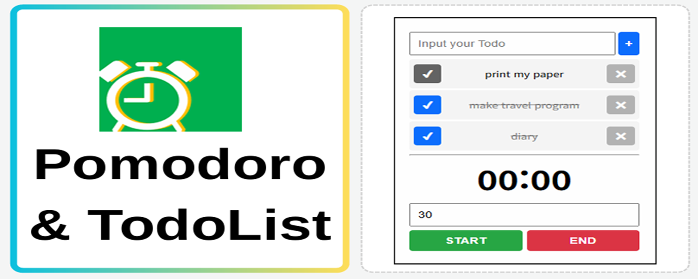
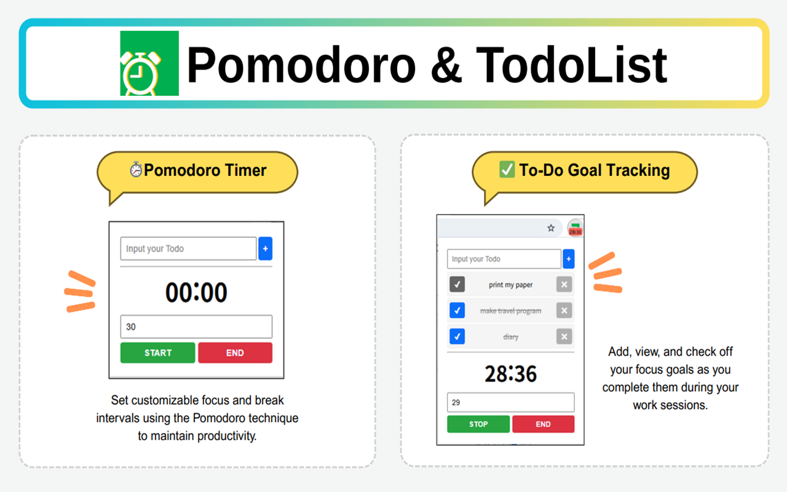
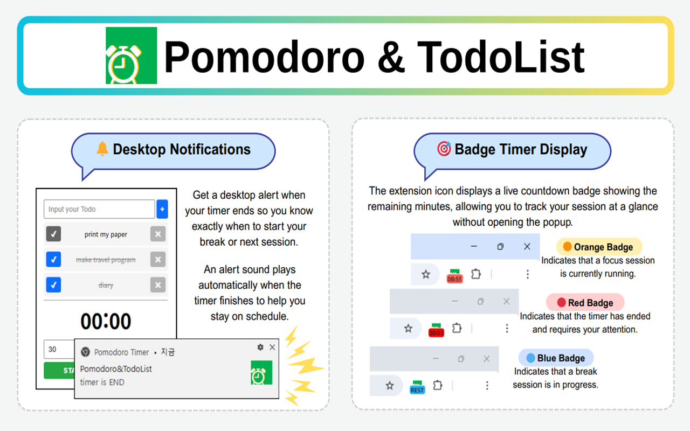

# Focus Timer - Chrome Extension

A simple and effective Pomodoro timer Chrome Extension to help you stay focused and productive.  
Includes customizable timers, to-do tracking, notifications, sound alerts, and badge countdowns.

---

## 🚀 Features




---

## 🎨 Badge Color Indicators

- 🟠 **Orange** – Focus session is running  
- 🔵 **Blue** – Break session is running  
- 🔴 **Red** – Timer has ended and needs your attention

---

## 🔐 Required Permissions

```json
"permissions": [
  "storage",
  "notifications",
  "scripting"
],
"host_permissions": [
  "<all_urls>"
]
```

### Why these are needed:

- `storage`: Save user settings, timer state, and to-do list data
- `notifications`: Show desktop alerts when a timer ends
- `scripting`: Execute scripts (e.g., play sound) in the active tab
- `host_permissions`: Required to inject scripts into active web pages via `chrome.scripting.executeScript()`

---

## 🎯 Sole Purpose

This Chrome Extension is solely intended to help users improve focus and productivity through the Pomodoro technique. It provides a timer with customizable intervals, desktop notifications, sound alerts, and badge countdowns to support time management and goal tracking.

---

## 📁 Folder Structure (예시)

```
Focus-Timer/
├── manifest.json
├── popup.html
├── popup.js
├── background.js
├── sound/
│   └── alert.mp3
├── images/
│   └── icon.png
├── styles.css
└── README.md
```

---

## 🛠️ How to Install (for local testing)

1. Clone or download this repository.
2. Open `chrome://extensions/` in your browser.
3. Enable **Developer Mode** (top-right corner).
4. Click **"Load unpacked"** and select the project folder.
5. Start using the Focus Timer!

---

## 📌 Notes

- This extension does **not** collect or transmit any user data.
- All stored data stays in your local Chrome storage.

---

## 📬 Contact

For bug reports or feature requests, please open an issue or contact the developer.
